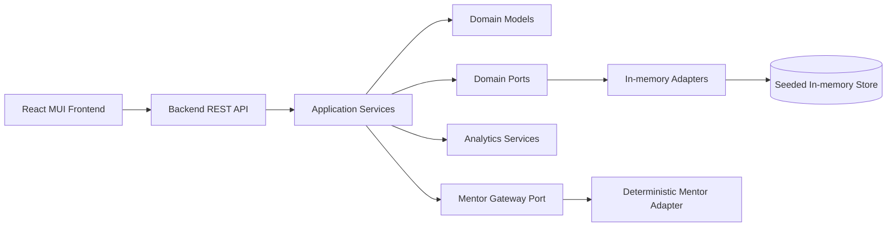
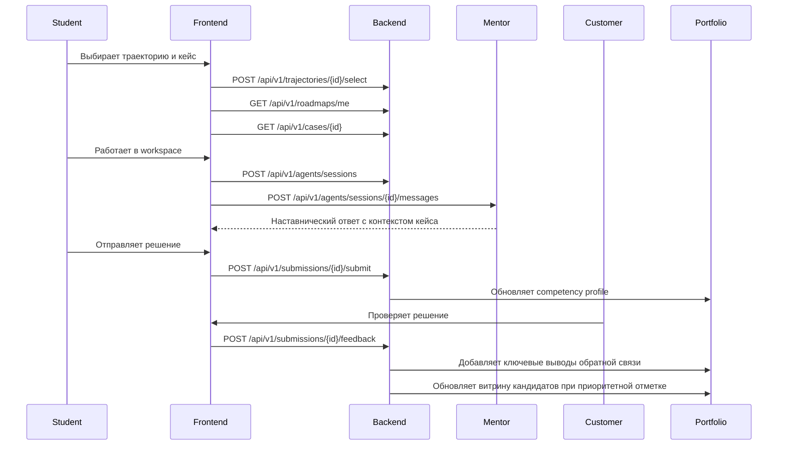

# Архитектура

СберТрек Платформа реализована как демонстрационный MVP с разделением backend и frontend.
Backend построен на Kotlin и Spring Boot в одном модуле `backend`.
Внутри backend используется слоистая структура `Controller -> Application -> Domain <-> Infrastructure`.
REST-контроллеры принимают DTO и не содержат бизнес-логики.
Application-сервисы оркестрируют сценарии: вход, каталог, отправки, обратную связь, портфолио, витрину кандидатов, модерацию, траектории, roadmap, аналитику и ИИ-наставников.
Domain-модели содержат инварианты и поведение: переходы статусов кейсов, отправок, roadmap-шагов и мастер-промптов.
Infrastructure слой реализован in-memory adapters с seed-данными.
Модуль наставников имеет порт будущей интеграции; текущая реализация детерминирована и работает локально.
Frontend построен на React, TypeScript и MUI, с role-based routes и демо-входом.
Swagger UI доступен через springdoc, статический краткий контракт лежит в `contracts/openapi`.
Docker Compose поднимает backend и production frontend через nginx.

